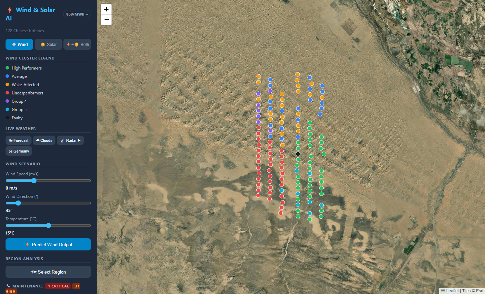
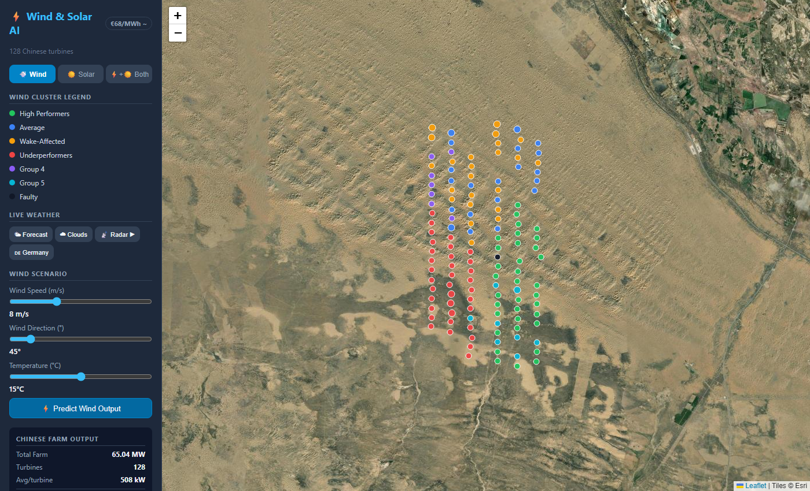
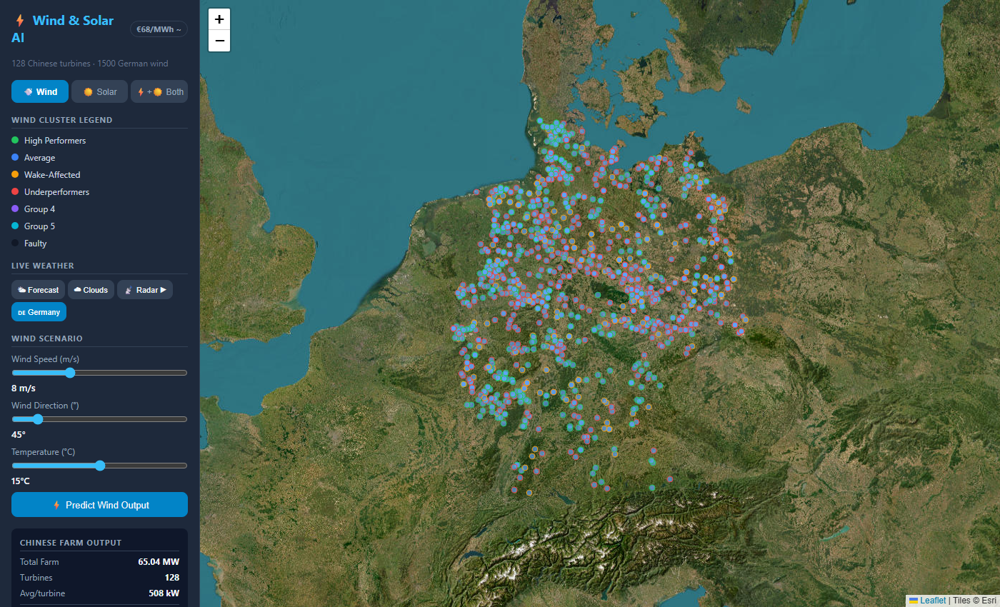
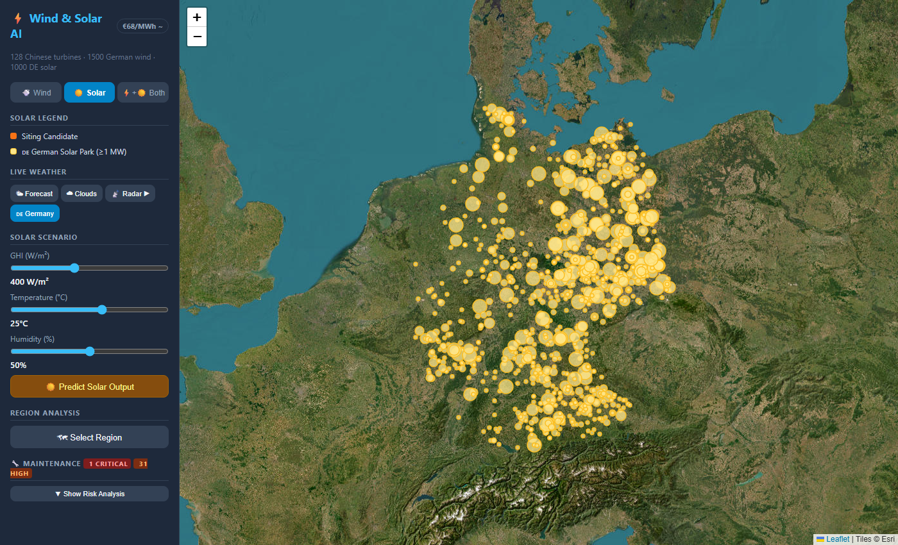
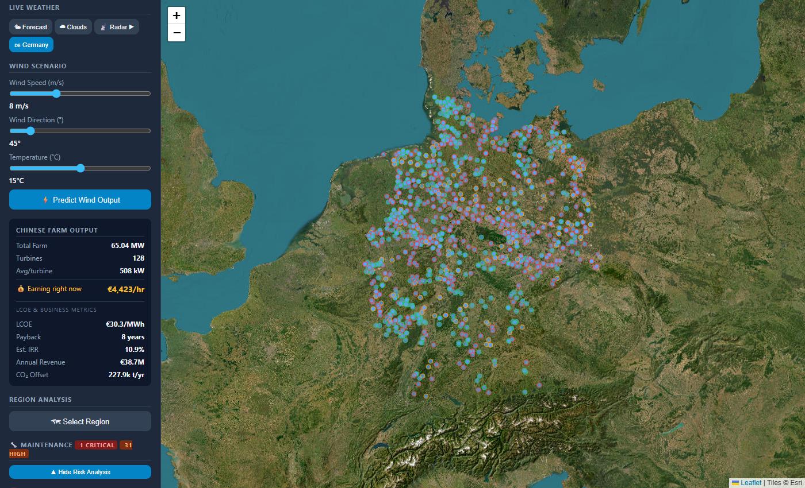
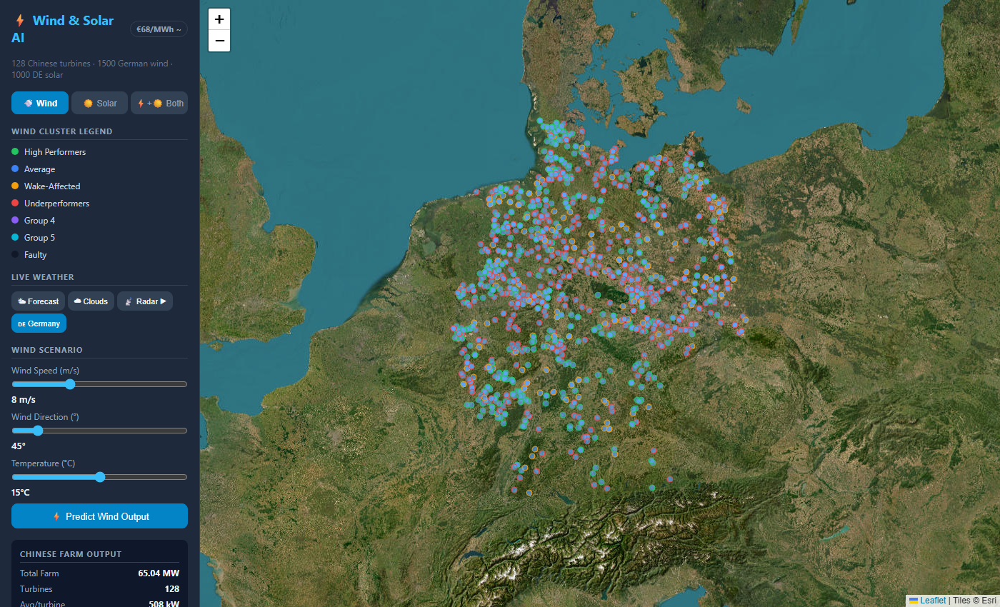

# ⚡ EnergyInsight — Renewable Energy Intelligence Platform

> **Top-5 finalist** at the E.ON Energy Hackathon. An end-to-end platform that turns raw
> wind- and solar-farm telemetry into operational decisions: power forecasting, fleet
> health monitoring, terrain-aware site selection, and investment-grade financial modelling
> — all on an interactive satellite map.



---

## What it does

EnergyInsight ingests SCADA telemetry from a real 134-turbine wind farm (the Baidu **SDWPF**
dataset, Inner Mongolia) plus Germany's national wind & solar asset registry, and exposes six
capabilities through a single map-based UI:

| Capability | Question it answers | How |
|---|---|---|
| 🔮 **Power Forecasting** | "How much power will this fleet produce under tomorrow's weather?" | Gradient-boosted (LightGBM) power-curve model with wake-effect features — **MAE ≈ 60 kW on 1.5 MW turbines** |
| 🩺 **Fleet Health & Maintenance** | "Which turbines are degrading and when can I service them?" | Per-turbine KPI scoring + a low-wind maintenance-window finder over a 16-day forecast |
| 🧭 **Wind Site Selection** | "Where should the next turbines go?" | Terrain-aware siting that scores wind resource, elevation, slope, wake shadow and spacing |
| ☀️ **Solar Forecasting & Siting** | "What about solar?" | Irradiance-driven capacity-factor model + solar-park site ranking |
| 🗺️ **Fleet Clustering** | "How does the fleet segment by performance?" | DBSCAN / K-Means over engineered turbine statistics (High Performers → Wake-Affected → Faulty) |
| 💶 **Investment Modelling** | "Is the site bankable?" | Live **LCOE, IRR, payback, annual revenue and CO₂ offset** from market electricity prices |



---

## Why it stands out

- **Real data, real physics.** Models are trained on 4.7M rows of 10-minute SCADA records and
  augmented with engineered **wake-effect features** (upstream turbine count, shadowing,
  yaw-misalignment) — not toy data.
- **Two markets, one engine.** The Chinese SDWPF fleet is used to *learn* turbine behaviour;
  the model is then transferred onto Germany's national asset registry to forecast real,
  operating parks.
- **Decision-grade outputs.** Every prediction is wrapped in operational and financial context
  (LCOE / IRR / payback), so the output is something an asset manager could actually act on.
- **Zero-cost data stack.** All weather, reanalysis and asset data come from free, key-less
  public APIs (Open-Meteo ERA5, Open Power System Data), so the platform runs end-to-end with
  no paid services.

|  |  |
|:---:|:---:|
| German wind fleet, model-transferred forecasts | Solar park siting & yield |
|  |  |
| Maintenance-risk scoring & service windows | Per-turbine performance analytics |

---

## Architecture

```
                         ┌─────────────────────────────┐
   Public data sources   │  React + Leaflet frontend   │
   ───────────────────   │  satellite map · charts ·   │
   • SDWPF SCADA (CN)     │  LCOE/IRR financial panel   │
   • OPSD asset registry  └──────────────┬──────────────┘
   • Open-Meteo ERA5                      │ REST (JSON)
                                          ▼
                          ┌──────────────────────────────┐
                          │   FastAPI service (25+ routes)│
                          ├──────────────────────────────┤
                          │  PowerPredictor   (LightGBM)  │
                          │  SolarPredictor   (LightGBM)  │
                          │  TurbineClustering (DBSCAN)   │
                          │  Siting engine    (terrain)   │
                          │  Maintenance / optimizer      │
                          └──────────────┬───────────────┘
                                         ▼
                          ┌──────────────────────────────┐
                          │  Feature engineering pipeline │
                          │  cleaning · wake features ·   │
                          │  per-turbine statistics       │
                          └──────────────────────────────┘
```

### Tech stack
- **ML / data:** Python, LightGBM, scikit-learn, pandas, NumPy, SciPy, PyArrow
- **API:** FastAPI + Uvicorn, serving 25+ REST endpoints
- **Frontend:** React 19, Vite, React-Leaflet (satellite tiles), interactive charts
- **Data:** Baidu SDWPF wind dataset · Open Power System Data (Germany) · Open-Meteo (forecast + ERA5 reanalysis)

---

## Repository layout

```
src/
├── preprocessing.py          # SCADA cleaning, feature & wake-effect engineering
├── models/
│   ├── power_predictor.py    # LightGBM wind-power model
│   ├── solar_predictor.py    # LightGBM solar-yield model
│   ├── clustering.py         # DBSCAN / K-Means fleet segmentation
│   ├── siting.py             # terrain-aware wind site scoring
│   ├── solar_siting.py       # solar park site ranking
│   └── optimizer.py          # pitch / yaw set-point optimisation
└── api/
    ├── main.py               # FastAPI app — all routes
    ├── germany.py            # German wind/solar asset loaders
    ├── weather.py            # Open-Meteo forecast + elevation
    ├── historical.py         # ERA5 reanalysis monthly stats
    └── maintenance.py        # risk scoring + service-window finder
frontend/                     # React + Leaflet single-page app
train.py                      # one-shot: preprocess → train → save models
train_solar.py                # train the solar model
download_germany.py           # fetch German asset registry
models/                       # pre-trained models (app runs out of the box)
```

---

## Running it locally

### 1. Backend

```bash
python -m venv .venv
# Windows:  .venv\Scripts\activate
# macOS/Linux:  source .venv/bin/activate
pip install -r requirements.txt

# Pre-trained models are included in models/, so you can start straight away:
uvicorn src.api.main:app --reload --port 8000
```

The API is now at `http://localhost:8000` (interactive docs at `/docs`).

### 2. Frontend

```bash
cd frontend
npm install
npm run dev        # dev server at http://localhost:5173

# or build static assets served directly by FastAPI:
npm run build
```

### 3. (Optional) Retrain from raw data

The large SCADA dataset is **not** committed (it is several GB). To retrain:

1. Download the Baidu **SDWPF** dataset and place it under `24798654/SDWPF_dataset/`.
2. Fetch German asset data: `python download_germany.py`
3. Train: `python train.py` and `python train_solar.py`

---

## Selected API endpoints

| Method | Route | Purpose |
|---|---|---|
| `POST` | `/api/predict` | Forecast fleet power from a weather scenario |
| `POST` | `/api/siting` | Rank candidate wind-turbine locations in a bbox |
| `POST` | `/api/solar/siting` | Rank candidate solar-park locations |
| `GET`  | `/api/maintenance/risk` | Maintenance-risk score for every turbine |
| `GET`  | `/api/maintenance/windows` | Upcoming low-wind service windows |
| `GET`  | `/api/clusters` | Fleet performance clusters |
| `GET`  | `/api/germany/turbines` | German wind fleet in a bounding box |
| `GET`  | `/api/electricity/price` | Live market price for financial modelling |

---

## Notes

This project was built under hackathon time pressure and placed in the **top 5**. The code
favours clarity and breadth of working features over exhaustive test coverage. Datasets and
slide decks are intentionally excluded from version control; see the retraining section above.

---

*Built by Yunes Mahan.*
